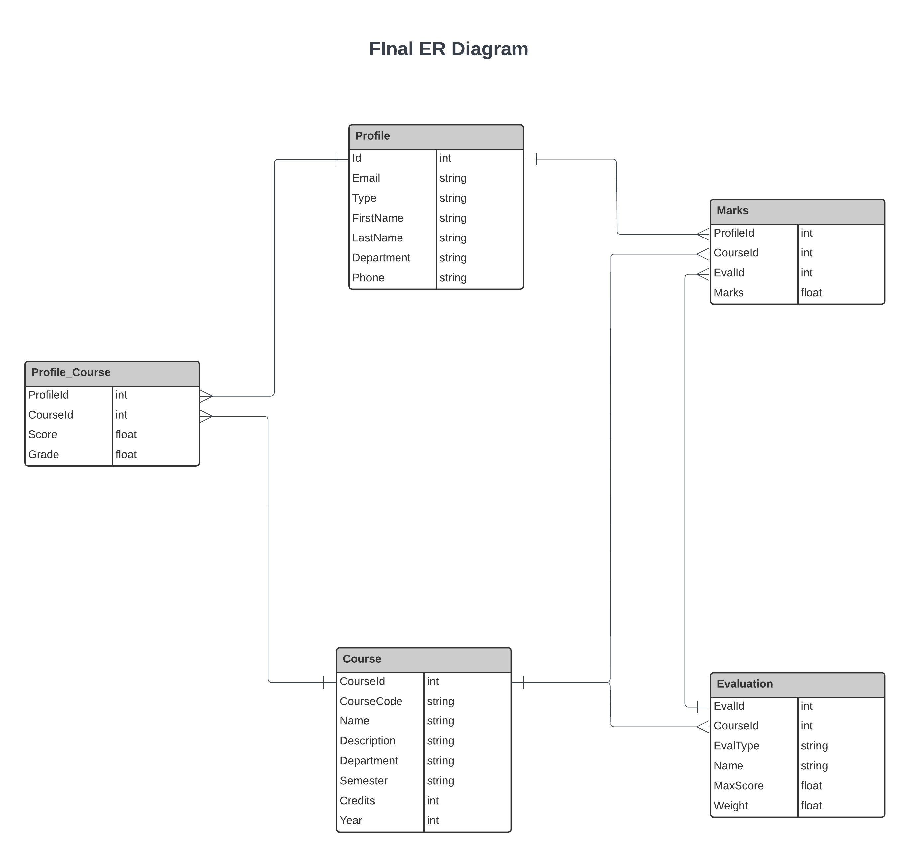
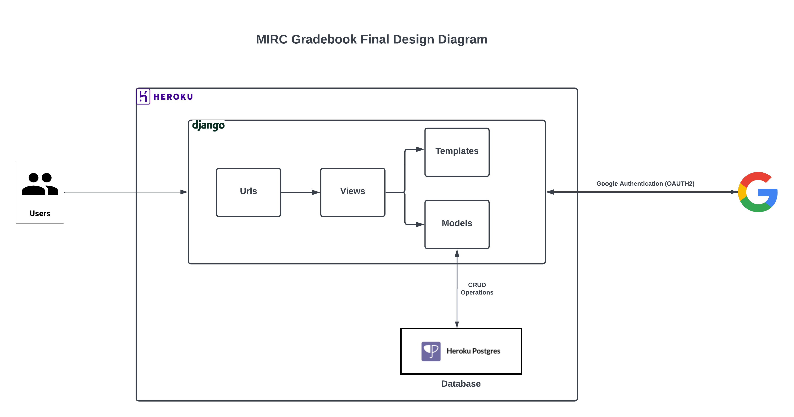

# MIRC-Gradebook
## CSCE 606: Software Engineering Course Project

### Team Name: Agile Sprinters

### Members: 
1.	[Satish Kumar Reddy Madduri](mailto:satish_reddy@tamu.edu) 
2.	[Pranav Anand Taukari](mailto:pranav.taukari@tamu.edu)  
3.	[Vivek Vamsi Inala](mailto:vivekvamsi@tamu.edu)
4.	[Ashutosh Chauhan](mailto:ashutosh@tamu.edu)
5.	[Sagar Adhikari](mailto:sagar0073@tamu.edu) 
6.	[Harshavardhan Manne](mailto:harshavardhan_manne@tamu.edu)

### Clients:
1. [Dr. Korok Ray](mailto:korok@tamu.edu)

### Summary: 

The main idea behind this project is to create an analytics-based prediction model which gives the real time grade/ feedback to the students enrolled in a course. While there is an existing option on Canvas to see the possible grade based on a rigid absolute grading pattern, this tool extends its capabilities by enabling grade prediction for even relative grading. The scope of the data used in this analytics or computation contains the scores obtained by the students in various performance measures like quizzes, assignments, projects, presentations & homeworks conducted till that point in time. The primary stakeholders for this project are the professors teaching various courses at Mays Innovation Research Center (MIRC) and the eventual plan is to integrate this tool with canvas and take it live (on a test basis) for one or two courses for Spring 2023 semester.

### Project Links
* [Pivotal Tracker](https://www.pivotaltracker.com/n/projects/2598982)

### Iterations
* [Iteration0](https://github.com/satish-reddy-tamu/MIRC-Gradebook/blob/main/documentation/Fall2022/i0.tar)
* [Iteration1](https://github.com/satish-reddy-tamu/MIRC-Gradebook/blob/main/documentation/Fall2022/i1.tar)
* [Iteration2](https://github.com/satish-reddy-tamu/MIRC-Gradebook/blob/main/documentation/Fall2022/i2.tar)
* [Iteration3](https://github.com/satish-reddy-tamu/MIRC-Gradebook/blob/main/documentation/Fall2022/i3.tar)
* [Iteration4](https://github.com/satish-reddy-tamu/MIRC-Gradebook/blob/main/documentation/Fall2022/i4.tar)
* [Iteration5](https://github.com/satish-reddy-tamu/MIRC-Gradebook/blob/main/documentation/Fall2022/i5.tar)

### Setup:
This project uses Django Framework with python.
1. Git clone this repo.
2. pip install -r requirements.txt
3. python manage.py runserver -> to start the server locally.

### Diagrams

